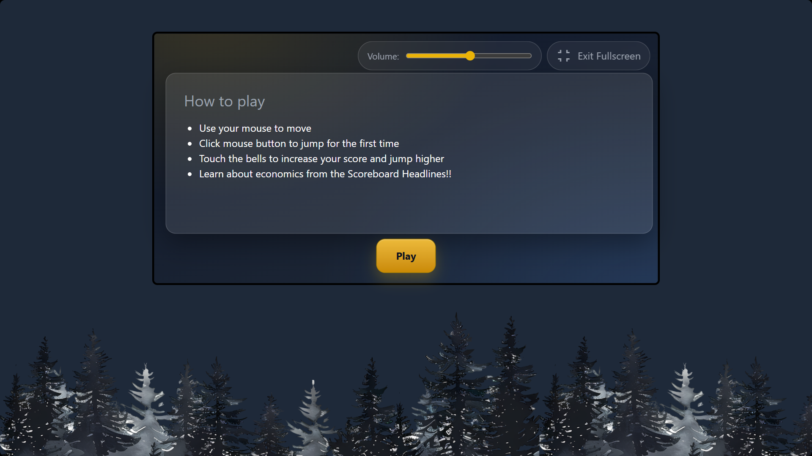
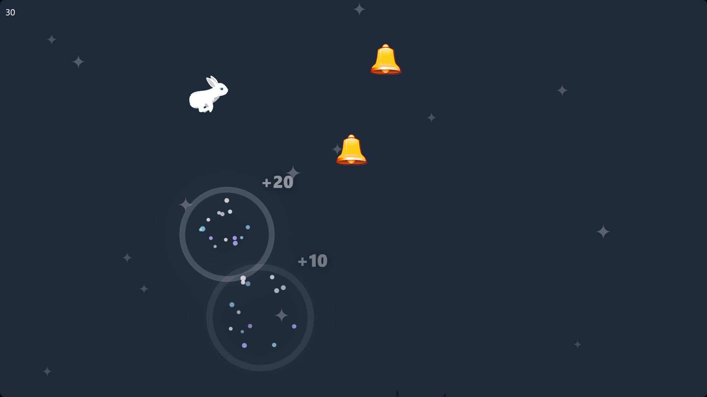
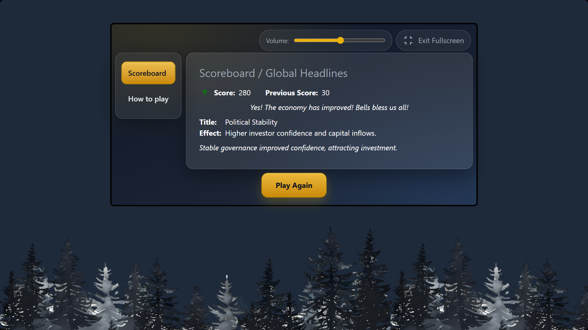

# 🐇 Bunny Economics

_A whimsical hop through bells, carrots, and civic economics._

🔗 **Play online:** [bunny-economics.com](https://bunny-economics.com)

---

## 📖 About the Game

Bunny Economics was created for **Hack the System**, a civic and economic tech hackathon.  
It’s a lighthearted game where you play as a curious bunny hopping across bells to collect points.

When you fall, your score is compared to your previous run:  
- **Do better** → the economy is “blessed” with humorous news of growth.  
- **Do worse** → playful headlines reveal challenges like tariffs, recessions, or carrot shortages.  
- **Land in the middle** → stability!  

Economics can feel distant or intimidating. Bunny Economics makes it approachable and fun. Instead of graphs and jargon, players see cause and effect through whimsical headlines and outcomes.

---

## ✨ Features

- 🐇 Hop on bells to collect points.  
- 📈 Fall down and compare your score to your last run.  
- 📰 Get whimsical news flashes about the bunny economy.  
- 🎮 Difficulty increases the longer you play, keeping you engaged.  

---

## 🎥 Gameplay Preview

<!-- Replace these placeholders with actual screenshots or GIFs -->
|  |  |
|-----------------------------------------|-----------------------------------------|
|  |  |

---

## 🛠️ Tech Stack

- [SvelteKit (Svelte 5)](https://kit.svelte.dev/)  
- [TailwindCSS](https://tailwindcss.com/)  

> Both were chosen for their ability to quickly prototype a demo or idea.

---

## 🚀 Setup & Run

Clone the repo and run the project locally:

```bash
cd frontend
npm install
npm run dev
```

- Confirmed working on **Node v24.2.0**

---

## 🏆 Competition Context

- **Hackathon:** Hack the System (Civic & Economic Tech Hackathon)  
- **Started:** August 25th (a month late into the competition)  
- **Built By:** Solo project – designed, coded, and shipped entirely by me in a short span of time.  

---

## 💡 Challenges

I honestly thought I would be able to animate the bunny a lot better than I did.  
I ended up falling back to a sprite sheet for each frame animation is *very difficult* when you’re trying it for the first time.

---

## 🪞 Reflections

There are many things I would have changed if I had more time.  
I cut back on features that would have improved gameplay due to the limited timeline.  

The greatest reflection: partnering with someone more experienced in animation would have allowed the game to shine a lot more, especially since the bunny is the central part of the game.

---

## 🔮 Next Steps

- Add addictive and rewarding gameplay features, such as **collectible bonuses** that randomly spawn.  
- Instead of simple precompiled headlines, add persistence of state (tracking **labor force, tariffs, inflation, etc.**) to better showcase how these changes connect to economic concepts.  

---

## 🌍 Vision

By disguising learning as laughter, Bunny Economics encourages players of all backgrounds to engage with civic and economic systems.  

Every hop is both a game and a lesson—showing that even small steps can shift the economy (and maybe the world) toward prosperity.

---

## 📜 License

This project is licensed under the [MIT License](./LICENSE).

---

## 🙏 Acknowledgments

- **Hack the System** organizers for inspiring civic and economic innovation.  
- The open-source community for tools that made rapid prototyping possible.  
